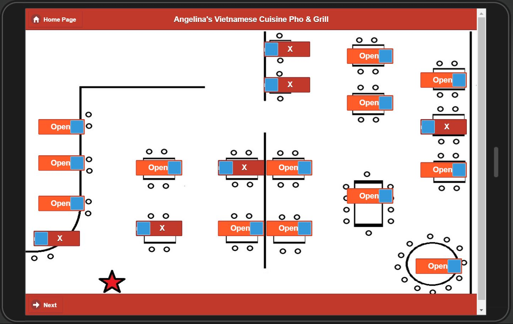
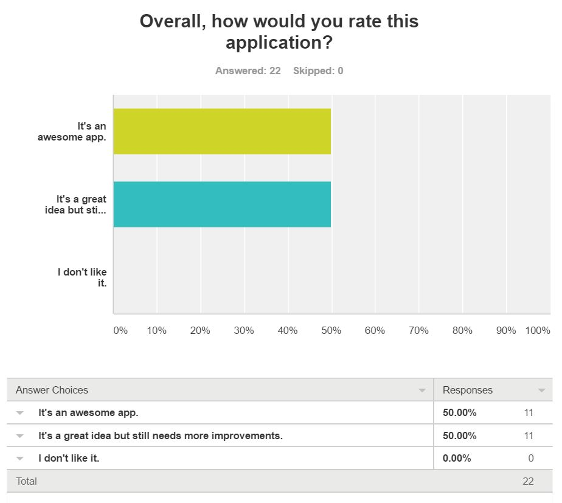

# RunTheRest  

#### Team members: 
- Lei Jiang
- Dejia Meng
- Y Nguyen

#### Elevator pitch: 
>Have you ever been to a restaurant that it took forever for the waiter to come and take your order? And then another long wait for the food to come out? 

>We tend to blame the waiter and tip them a little less than usual. But let’s think thoroughly, it’s the whole restaurant system that should be taken into account. 

>So the project idea is to create a fully integrated restaurant POS system, we called it **Run The Rest**. 

>This system fulfills all tasks from taking wait-lists, estimating wait time, organizing tables, taking and tracking order, communicating between the waiters and kitchen staffs, with advanced real-time reporting, and loyalty programs for regular customers.

#### Measurement plan: 
  * The time in minutes that it takes a user to accomplish a task. 
  * The quality of feedback obtained from users

### Mockups screenshots

### Customer Feedback:

### Try it yourself! And let us know what do you think!

Click the link to our Survey feedback: https://www.surveymonkey.com/r/Y6C9GKV
